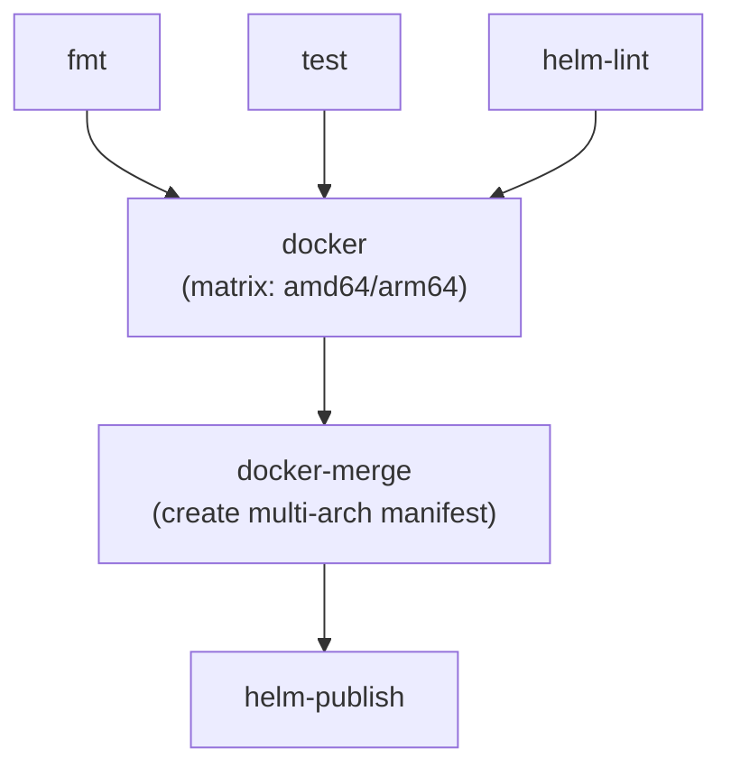

# Releasing

This document describes how the CI/CD pipeline builds, versions, and publishes artifacts.

## Overview

The CI pipeline automatically builds and publishes Docker images and Helm charts to GitHub Container Registry (GHCR) on:
- Every push to `main`
- Every version tag (`v*`)

Pull requests only run tests and linting - no artifacts are published.

## Versioning Strategy

### Docker Images

| Trigger              | Tags Published                         |
|----------------------|----------------------------------------|
| Push to `main`       | `latest`, `sha-<commit>`               |
| Tag `v1.2.3`         | `v1.2.3`, `v1.2`, `v1`, `sha-<commit>` |
| Tag `v1.2.3-beta.1`  | `v1.2.3-beta.1`, `sha-<commit>`        |

The `v1.2` and `v1` tags are "floating" - they always point to the latest patch/minor release in that series. Prerelease tags (containing `-`) do not update floating tags.

### Helm Charts

| Trigger              | Versions Published                      | Image Tag              |
|----------------------|-----------------------------------------|------------------------|
| Push to `main`       | `0.0.0-main.<sha>`, `0.0.0-latest`      | `latest`               |
| Tag `v1.2.3`         | `1.2.3`, `1.2.0-latest`, `1.0.0-latest` | `v1.2.3`, `v1.2`, `v1` |
| Tag `v1.2.3-beta.1`  | `1.2.3-beta.1`                          | `v1.2.3-beta.1`        |

Each Helm chart version embeds the corresponding Docker image tag, so chart and image versions stay in sync.

#### Why `X.Y.0-latest` versions?

Docker supports "floating" tags like `v1` and `v1.2` that always point to the latest release in a series. Helm OCI registries require [valid semver](https://semver.org/), so `1` and `1.2` are invalid.

We work around this by using the `-latest` prerelease suffix:

| Docker Tag | Helm Equivalent   | Meaning                          |
|------------|-------------------|----------------------------------|
| `latest`   | `0.0.0-latest`    | Latest build from `main`         |
| `v1`       | `1.0.0-latest`    | Latest stable release in v1.x.x  |
| `v1.2`     | `1.2.0-latest`    | Latest stable release in v1.2.x  |
| `v1.2.3`   | `1.2.3`           | Exact version (no suffix needed) |

The `.0` padding ensures valid semver while the `-latest` suffix clearly indicates it's a floating reference. When you install `--version 1.0.0-latest`, you get whatever the current v1.x release is, with the chart configured to pull the matching `v1` Docker image.

## How to Release

### Development Builds (automatic)

Every push to `main` automatically publishes:
- Docker: `ghcr.io/azure/kube-state-logs:latest`
- Helm: `0.0.0-latest`

### Stable Release

1. Ensure `main` is in a releasable state
2. Create and push a version tag:

```bash
git tag v1.0.0
git push origin v1.0.0
```

This publishes:
- Docker: `v1.0.0`, `v1.0`, `v1`
- Helm: `1.0.0`, `1.0.0-latest`, `1.0.0-latest`

### Prerelease

```bash
git tag v1.0.0-beta.1
git push origin v1.0.0-beta.1
```

This publishes only the exact version - no floating tags are updated.

## Installing

### Docker

```bash
# Latest from main
docker pull ghcr.io/azure/kube-state-logs:latest

# Specific version
docker pull ghcr.io/azure/kube-state-logs:v1.2.3

# Latest in v1.2.x series
docker pull ghcr.io/azure/kube-state-logs:v1.2

# Latest in v1.x series
docker pull ghcr.io/azure/kube-state-logs:v1
```

### Helm

```bash
# Latest from main
helm install kube-state-logs oci://ghcr.io/azure/kube-state-logs/charts/kube-state-logs --version 0.0.0-latest

# Specific version
helm install kube-state-logs oci://ghcr.io/azure/kube-state-logs/charts/kube-state-logs --version 1.2.3

# Latest in 1.x series
helm install kube-state-logs oci://ghcr.io/azure/kube-state-logs/charts/kube-state-logs --version 1.0.0-latest

# Latest in 1.2.x series  
helm install kube-state-logs oci://ghcr.io/azure/kube-state-logs/charts/kube-state-logs --version 1.2.0-latest
```

## Architecture

### Supported Architectures

Docker images are built for the following platforms:

| Platform      | Runner             |
|---------------|--------------------|
| `linux/amd64` | `ubuntu-24.04`     |
| `linux/arm64` | `ubuntu-24.04-arm` |

Both architectures are built natively using GitHub Actions runners (no QEMU emulation), ensuring fast builds and native performance testing.

### Adding Additional Architectures

To add support for a new architecture:

1. **Update `.github/workflows/ci.yml`** - Add to the `matrix.include` section in the `docker` job:
   ```yaml
   matrix:
     include:
       - platform: linux/amd64
         runner: ubuntu-24.04
       - platform: linux/arm64
         runner: ubuntu-24.04-arm
       # Add new architecture:
       - platform: linux/newarch
         runner: appropriate-runner
   ```

2. **Update `docker-merge` job** - Ensure the digest validation expects the correct number of architectures (currently expects exactly 2)

3. **Verify Dockerfile compatibility** - Ensure base images support the new architecture:
   - Build stage: `mcr.microsoft.com/oss/go/microsoft/golang:X.XX-fips-azurelinux3.0`
   - Runtime stage: `mcr.microsoft.com/azurelinux/base/core:3.0`

4. **Test the build** - Run a test build to ensure CGO and all dependencies compile for the new platform

**Note:** Adding architectures that require QEMU emulation (no native runner available) will significantly slow down builds.

### Build Pipeline



### Registry Paths

- Docker images: `ghcr.io/azure/kube-state-logs`
- Helm charts: `ghcr.io/azure/kube-state-logs/charts/kube-state-logs`

## Troubleshooting

### Authentication

For private repositories, authenticate before pulling:

```bash
# Docker
echo $GITHUB_TOKEN | docker login ghcr.io -u USERNAME --password-stdin

# Helm
echo $GITHUB_TOKEN | helm registry login ghcr.io -u USERNAME --password-stdin
```

### Invalid Version Tag

Tags must be valid semver: `vMAJOR.MINOR.PATCH` or `vMAJOR.MINOR.PATCH-prerelease`

Valid: `v1.0.0`, `v1.2.3-beta.1`, `v2.0.0-rc.1`
Invalid: `v1`, `v1.0`, `1.0.0`, `v1.0.0beta`
